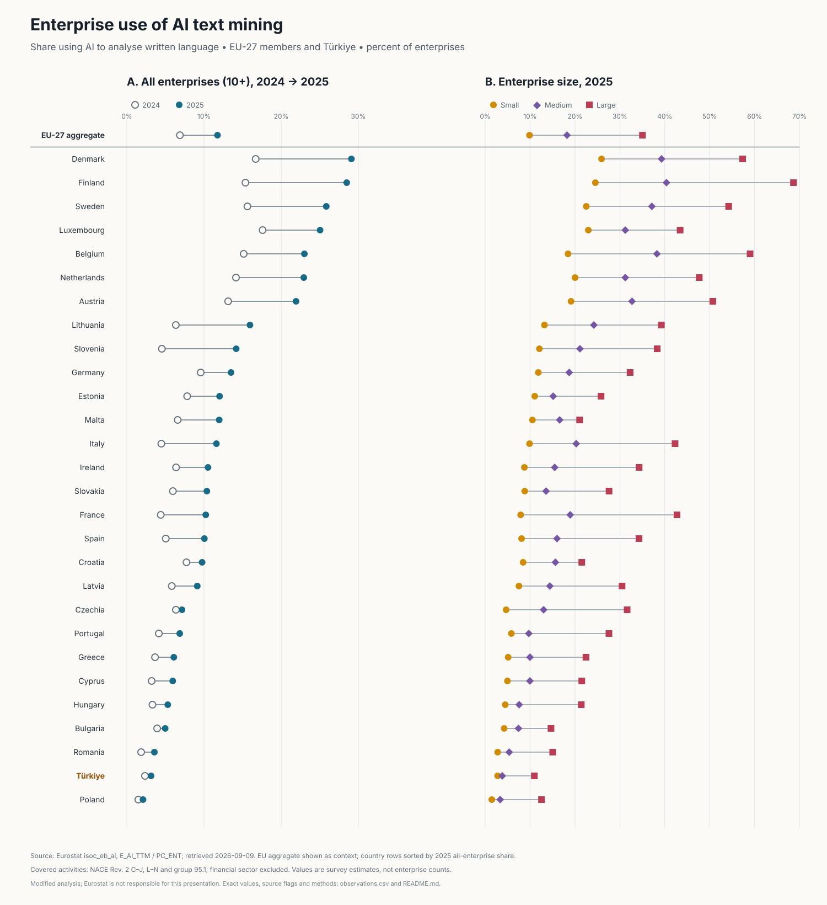

# Enterprise use of AI text mining: EU-27 and Türkiye, 2024–2025

**Status:** Local analysis draft; not approved for publication<br>
**Retrieved:** 2026-09-09T14:33:25+03:00<br>
**Eurostat data updated:** 2026-06-15T11:00:00+0200

## Question and frozen inclusion rules

Across the EU-27 member countries and Türkiye, how did the share of enterprises using AI technology to **analyse written language (text mining)** change from 2024 to 2025, and how did the 2025 share differ between small, medium and large enterprises?

The selection was fixed before interpreting results: annual frequency `A`; indicator `E_AI_TTM`; denominator `PC_ENT` (percentage of enterprises); NACE Rev. 2 aggregate `C10-S951_X_K`; years 2024 and 2025; sizes `GE10`, `10-49`, `50-249`, and `GE250`; the 27 members represented by `EU27_2020`, plus Türkiye as a separately labelled comparison. The EU aggregate is context and is not ranked as a country. This is one specific AI technology, **not** the broader “uses at least one AI technology” indicator.

## Findings



- **Source fact:** Eurostat reports the EU-27 aggregate at **6.88% in 2024** and **11.75% in 2025** for enterprises with 10 or more persons employed. The 2026 Eurostat results report independently presents these as 6.9% and 11.8% after rounding.
- **Calculation:** the EU-27 aggregate difference is **+4.87 percentage points**. All 28 comparison countries (27 EU members plus Türkiye) have a positive published difference in this snapshot. The largest are Finland (**+13.12 pp**), Denmark (**+12.41 pp**) and Sweden (**+10.22 pp**). This calculation describes two cross-sectional survey estimates; it does not track the same enterprises.
- **Calculation:** the highest 2025 all-enterprise shares are Denmark (**29.10%**), Finland (**28.49%**) and Sweden (**25.84%**); the lowest are Poland (**2.10%**), Türkiye (**3.14%**) and Romania (**3.57%**). Türkiye moves from **2.35%** to **3.14%** (**+0.79 pp**).
- **Calculation:** in 2025 the EU-27 values are **9.87% small**, **18.22% medium** and **35.04% large**, a large-minus-small difference of **25.17 pp**. Every included country has large > medium > small in this snapshot. Türkiye's corresponding values are **2.78%**, **3.81%** and **10.95%** (difference **8.17 pp**). These size differences are descriptive, not causal effects of enterprise size.
- **Inference:** none about causes, future adoption, statistical significance, or market value.

## Authoritative source and exact query

Eurostat is the publisher. The live JSON-stat response identifies dataset `ISOC_EB_AI` version `1.0`, title “Artificial intelligence by size class of enterprise”, DOI [10.2908/ISOC_EB_AI](https://doi.org/10.2908/ISOC_EB_AI), and embeds every selected code and label. Exact query:

```text
https://ec.europa.eu/eurostat/api/dissemination/statistics/1.0/data/isoc_eb_ai?freq=A&indic_is=E_AI_TTM&lang=en&nace_r2=C10-S951_X_K&sinceTimePeriod=2024&unit=PC_ENT&untilTimePeriod=2025
```

See Eurostat's [Data Browser entry](https://ec.europa.eu/eurostat/databrowser/view/isoc_eb_ai/default/table?lang=en), [statistics API guide](https://ec.europa.eu/eurostat/web/user-guides/data-browser/api-data-access/api-getting-started/api), [enterprise ICT metadata](https://ec.europa.eu/eurostat/cache/metadata/en/isoc_e_esms.htm), and [2026 AI results report](https://ec.europa.eu/eurostat/web/products-statistical-reports/w/ks-01-26-009). Revision and reuse decisions are recorded in [`provenance.json`](provenance.json).

## Outputs and reproduction

- [`raw/isoc_eb_ai_E_AI_TTM_2024_2025.json`](raw/isoc_eb_ai_E_AI_TTM_2024_2025.json): exact API response bytes
- [`raw/acquisition.json`](raw/acquisition.json): URL, HTTP metadata, retrieval time, byte count and raw SHA-256
- [`observations.csv`](observations.csv): tidy selected observations with original codes, labels, values and status fields
- [`country-summary.csv`](country-summary.csv): deterministic differences used in the prose/chart
- [`text-mining-adoption.svg`](text-mining-adoption.svg): deterministic accessible chart
- [`provenance.json`](provenance.json): complete machine-readable provenance and checksums

Replay the committed snapshot without network access:

```sh
go run ./cmd/eurostatai
```

Explicitly refresh it (one request, bounded retry/backoff/jitter, no credential):

```sh
go run ./cmd/eurostatai -fetch
```

A refresh replaces the raw snapshot and receipt only after JSON-stat and selection metadata validate. Review all resulting vintage and value changes before accepting them.

## Limitations

- The annual enterprise ICT survey is self-reported and estimated from samples; this slice does not include standard errors, so no significance claim is made. National collection and non-response methods can differ within Eurostat's harmonised framework.
- The denominator is enterprises in each size class, not employees, users, transactions, or all registered firms. The covered population has at least 10 employees or self-employed persons and covers NACE Rev. 2 sections C–J and L–N plus group 95.1; agriculture, forestry, fishing, mining, quarrying and finance are outside this aggregate.
- Eurostat's model questionnaire is updated annually. `E_AI_TTM` has the same live code and label in both selected years and Eurostat publishes a direct comparison, but future metadata or national breaks can affect comparability. The broader at-least-one indicator changed scope in 2025 when picture/video/sound generation was added; that is why this analysis does not use it.
- Values are current-database estimates and may be revised when national authorities submit corrections. The stored raw snapshot fixes this analysis vintage. Status flags are preserved; no selected cell in this snapshot is flagged or missing. Absence of a flag is not a precision guarantee.
- Aggregate and country values are weighted survey estimates. Do not average country percentages, infer enterprise counts, or interpret size-class differences as causal. Türkiye is a comparison country and is not included in the EU-27 aggregate.
- Enterprise use of one AI technology is not a count of AI vendors, AI-company revenue, model usage volume, productivity, or AI market size.

## Unresolved gate

Eurostat's official statistics API guides checked for this vintage do not state a numeric request-per-second quota. The explicit refresh therefore makes one bounded query, retries only HTTP 429/transient 5xx responses, honours `Retry-After`, and otherwise applies the repository's conservative network policy. This does not block offline reproduction, but a maintainer should re-check the service contract before scheduling refreshes.

Eurostat permits reuse of statistical data with acknowledgement. This repository stores a modified selection and presentation; Eurostat is not responsible for the analysis. Maintainer review of the question, reuse, calculations, caveats and artifacts is required before any publication.
