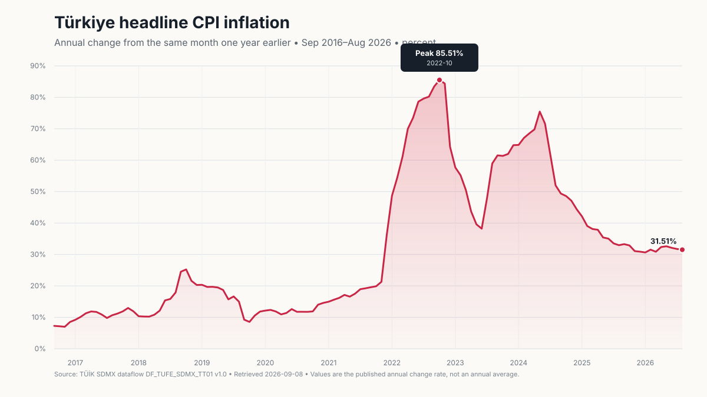

# Türkiye headline CPI inflation, trailing 10 years

**Status:** Local analysis draft; not approved for publication
**Retrieved:** 2026-09-08
**Period:** September 2016–August 2026 (120 consecutive months)

## Question and measure

How did Türkiye's headline consumer price inflation change during the latest
120 months available on 2026-09-08?

“Inflation” is defined here as TÜİK's monthly **general CPI annual rate of
change**: the percentage change from the same month of the previous year. It is
not the month-over-month rate or the 12-month moving-average rate.

## Result



- **Fact:** the latest observation is **31.51% in August 2026**. This matches
  TÜİK's [August 2026 CPI release](https://veriportali.tuik.gov.tr/en/press/58290).
- **Calculation:** the maximum among the 120 retrieved observations is
  **85.51% in October 2022**. TÜİK's
  [October 2022 CPI release](https://veriportali.tuik.gov.tr/en/press/45799)
  independently reports the same value.
- **Inference:** none. The chart does not attribute causes or make a forecast.

## Source selection

- Publisher: Türkiye İstatistik Kurumu (TÜİK)
- Documentation:
  <https://veriportali.tuik.gov.tr/tr/sdmx-web-service-documentation>
- Dataflow: `DF_TUFE_SDMX_TT01`, version `1.0`
- Official title: “Ana harcama gruplarına göre tüketici fiyat endeksi (TÜFE)
  ve değişim oranları”
- DSD resolved from the dataflow: `DSD_TUFE`, version `1.12`
- Series key:
  `TR.M.TUFE.4._Z.2025.2026_01._Z.0.F_TFE`
- Measure label: “Bir önceki yılın aynı ayına göre (yıllık) değişim oranı (%)”

The exact dimensions, request URL, SDMX message timestamp, retrieval timestamp,
response metadata, raw byte count, and raw/output SHA-256 values are recorded in
[`provenance.json`](provenance.json). Raw response bytes are not stored because
redistribution and snapshot terms have not yet been verified.

## Outputs and reproduction

- [`inflation.csv`](inflation.csv): machine-readable observations
- [`inflation.svg`](inflation.svg): generated presentation artifact
- [`provenance.json`](provenance.json): source and validation record

With `TUIK_API_KEY` supplied securely at runtime:

```sh
go run ./cmd/inflation10y
go test ./...
```

The generator requires one exact series, verifies every dimension, requires 120
unique consecutive monthly periods, rejects non-numeric observations, and
reconciles the latest value to the official release.

## Limitations and revisions

- This is headline, unadjusted CPI and not a household-specific cost-of-living
  measure.
- TÜİK introduced the 2025=100 reference base and COICOP 2018 structure in
  January 2026. The current API series identifies `BASE_PER=2025`,
  `COICOP_2018=0`, and publication dimension `YAYIM_DONEMI=2026_01` across the
  displayed history.
- The values represent the current API vintage and may change if TÜİK revises
  or backcasts the series. CSV and SVG checksums make output drift visible. The
  raw-response checksum binds a retrieval, but is expected to change because
  SDMX message IDs and preparation timestamps are generated per request.
- API rate limits, general service terms, and output redistribution permissions
  remain unverified. Nothing here has been committed or published.
