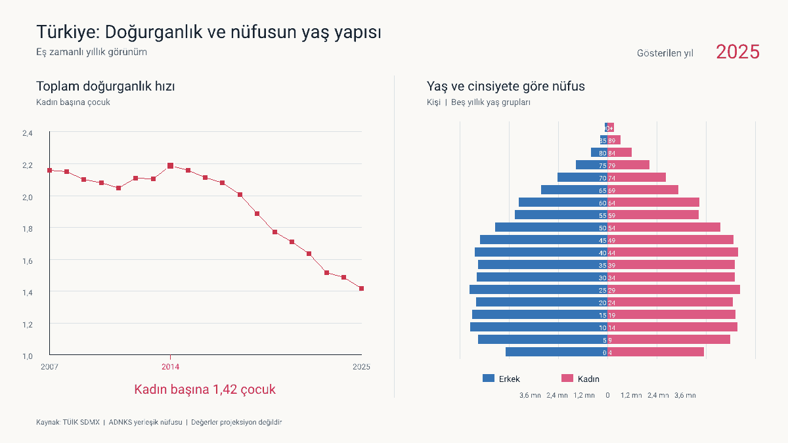

# Türkiye fertility and population pyramid, 2007–2025

**Status:** Local review draft; not approved for publication

**Retrieved:** 2026-09-10

**Period:** 2007–2025 (19 separate synchronized annual images)

## Question and measures

How did TÜİK's total fertility rate and Türkiye's age-sex population structure
change together over the common ADNKS period?

The left panel uses TÜİK indicator `NG_TDH`, whose exact official Turkish label
is **Toplam Doğurganlık Hızı (Çocuk Sayısı)**. It is a period total fertility
rate: the number of children a woman would have over her reproductive life if
the current year's age-specific fertility rates continued. It is not the
observed number of births divided by the number of women. Live SDMX metadata
verifies the title and “Çocuk Sayısı” unit but did not expose a separate
indicator-specific definition; that missing methodological citation is a review
gate recorded in the source record.

The right panel uses ADNKS resident-population counts for Türkiye by sex and
consistent five-year age group, with a final `90+` group. It uses counts, not
shares or projections. Both panels show the same year in every image.



## Results

- **Fact:** the current-vintage fertility series falls from **2.16 in 2007** to
  **1.4185357182807 in 2025** (displayed as 1.42).
- **Fact:** fertility observations for 2020–2024 carry TÜİK status `R`
  (**Revize edilmiş değer**); 2025 carries `A` (**Normal değer**).
- **Calculation:** summing the 38 age-sex population cells gives **70,586,256**
  people in 2007 and **86,092,168** in 2025.
- **Calculation:** the maximum fertility value in the selected common period is
  **2.1861791156 in 2014**.
- **Calculation/presentation:** every later annual fertility observation is
  lower than the preceding one. The chart highlights the 2014 point and x-axis
  tick as the selected period's peak, without an explanatory callout. This is a
  descriptive breakpoint, not a causal claim.
- **Inference:** the annual images visually show a narrower young base and
  larger older cohorts alongside declining fertility. They do not establish
  causation.
- **Opinion:** none.

## Source selection and validation

Both sources are primary official TÜİK SDMX datasets resolved from live
structural metadata:

- Fertility: `DF_DOGUM_TEMEL_DOG_GOST_C` 1.0, DSD `DSD_DOGUM` 1.1,
  indicator `NG_TDH`, publication vintage `2026_01`.
- Population: `DF_ADNKS_T16` 1.0, DSD `DSD_ADNKS` 1.7,
  `IKAMET_YERI=_T`, `SEX=1+2`, `ADNKS_GOSTERGE=NUFUS`, and 19 stable age
  codes from `CL_YAS` 1.1.

The full ordered keys, URLs, response sizes, timestamps, message IDs, raw and
output checksums, labels, status codes, and validation rules are in
[`provenance.json`](provenance.json). The 2025 pyramid sum exactly matches the
all-age/all-sex value in TÜİK dataflow `DF_ADNKS_T27`. The current revised 2024
fertility value does not reproduce the earlier 1.48 headline exactly; this
vintage discrepancy is preserved and documented rather than hidden.

## Outputs and reproduction

- [`fertility.csv`](fertility.csv): 19 annual fertility observations and flags
- [`population.csv`](population.csv): 722 age-sex-year counts
- [`frames/`](frames): 19 separate PNG files named `2007.png` through
  `2025.png`, each 1200×675 pixels with an 8-color palette
- [`fertility-population-pyramid.gif`](fertility-population-pyramid.gif): the
  19 frames as a looping animation (600 ms per year)
- [`provenance.json`](provenance.json): machine-readable provenance and checksums

All visible chart copy is natural Turkish, including the current-year label,
units, legend, and source note. Turkish characters are rendered directly rather
than transliterated. The 2014 x-axis tick is always visible, and its data point
is highlighted in images for 2014 onward. There is no tooltip or callout.

Text uses repository-contained **Roboto Regular**, not a system Arial lookup or
the former 5×7 bitmap face. The exact 515,100-byte TTF comes from the official
Google Fonts Roboto repository at commit
`38062f4b4a0be4346d07a928408da21602545e9e`; its SHA-256 is
`56a45233d29f11b4dfb86d248e921939d115778f87325e7ae8cc108383d6664d`.
Roboto is redistributed under Apache License 2.0, whose complete text is stored
beside the font as
[`Roboto-LICENSE.txt`](../../cmd/fertilitypyramid/assets/Roboto-LICENSE.txt).
Rendering uses pinned `golang.org/x/image` v0.46.0 (`font/opentype`, with
`HintingNone`) and its pinned transitive `golang.org/x/text` v0.42.0 and
`golang.org/x/sys` v0.48.0 dependencies; all three Go modules use BSD-3-Clause.
The TTF is embedded at compile time, so regeneration is offline and does not
vary with fonts installed on the host. Module and asset checksums are retained
in `go.sum` and `provenance.json`.

```sh
# Byte-identically regenerate the yearly PNGs and animated GIF from the checked derived CSVs.
go run ./cmd/fertilitypyramid

# Explicitly refresh both derived CSVs and provenance (requires TUIK_API_KEY).
go run ./cmd/fertilitypyramid -fetch

go test ./...
```

## Limitations and revision gates

- A total fertility rate is a synthetic-period measure, not a completed-cohort
  outcome or forecast.
- The open-ended `90+` category hides variation at the oldest ages.
- Population is year-end ADNKS resident population. No population projection is
  mixed into the annual images.
- Raw responses are not stored because reuse/redistribution terms remain
  unresolved. Exact reproducible queries and checksums are retained instead.
- TÜİK may revise either series. Fertility flags already identify revisions for
  2020–2024; missing and flagged values are never treated as zero or interpolated.
- Publication remains blocked pending maintainer review of source rights, the
  external methodological definition, calculations, and presentation.
