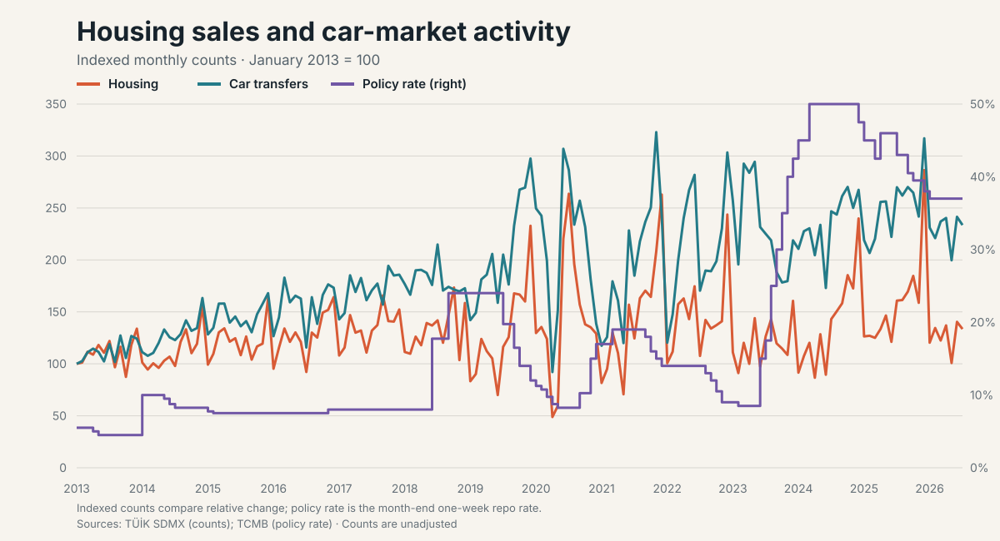
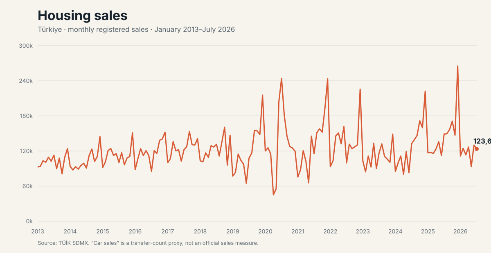
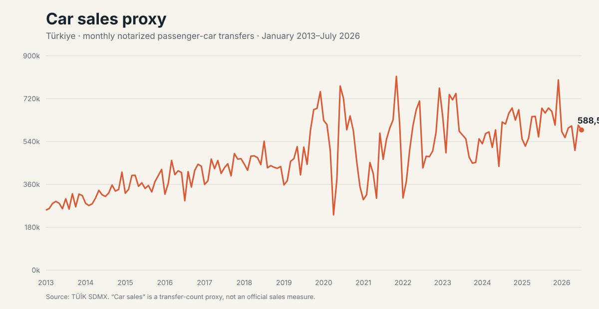

# Türkiye housing and car-market activity

**Status:** Local analysis draft  
**Period:** January 2013–July 2026 (163 consecutive months)

The requested series are shown separately. Both are nationwide monthly counts, but they should not be added or treated as equivalent transactions.

## Comparison



The combined chart indexes each sales series to January 2013 = 100 and plots
TCMB's one-week repo auction rate on the right axis. Indexing makes
their relative changes comparable without implying that a housing sale and a
passenger-car transfer are equivalent or obscuring one series because their raw
volumes differ. The chart retains the unadjusted monthly seasonality.

The interest-rate observation is the rate in force at each calendar month-end,
derived from TCMB's dated official rate-change table. It is a step series, not a
monthly average and not a consumer mortgage or vehicle-loan rate. The latest
month in the analysis, July 2026, is 37%.

## Housing sales



This is TÜİK's registered **total housing sales** series. July 2026 recorded 123,603 sales. January–July 2026 totalled 823,119, 5.47% below the same months of 2025. The 2025 total was 1,760,292.

## Car sales



The selected official table has no “used-car sales” measure. The chart therefore uses TÜİK's narrower count of passenger cars transferred through notaries (`Devri Yapılan … Otomobil`) and labels it a **sales proxy**. July 2026 recorded 588,504 transfers. January–July 2026 totalled 4,041,614, 2.79% below the same months of 2025. The 2025 total was 7,572,528.

## Sources and interpretation

TCMB's EVDS catalog independently lists TÜİK's total, first-hand, second-hand and mortgaged housing-sales series. Numeric observations here come from TÜİK's authenticated SDMX service, the source-owner service that also supplies the vehicle series. TCMB/EVDS is a catalog and availability cross-check, not a second owner of the observations.

- Housing: `DF_SATIS_SEKLI_SATIS_DURUMU_V3` v1.0, key `M._T.TR._Z._Z.2._Z._Z._T.MII_KSS._Z`
- Cars: `DF_MOTORLU_KARA_TASIT_DEVRI_YAPILAN_V3` v1.0, passenger-car transfer key recorded in `provenance.json`
- Interest rate: TCMB one-week repo auction rate, month-end value

These are unadjusted counts. Seasonality, working days, credit conditions, taxes and administrative availability can affect changes. The charts are descriptive and make no causal claim.

## Reproduce

With `TUIK_API_KEY` supplied at runtime:

```sh
go run ./cmd/marketsales
go test ./...
go vet ./...
```

The generator checks observation counts, integer values, unique periods and continuous monthly coverage before replacing the CSV and SVG files.
