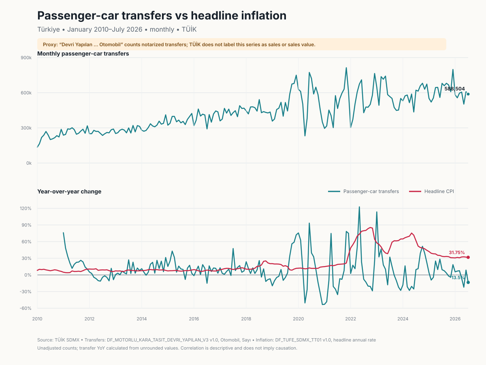

# Türkiye passenger-car transfers vs headline inflation

**Status:** Local analysis draft; not approved for publication  
**Retrieved:** 2026-09-08  
**Common period:** January 2010–July 2026 (199 consecutive months)

## Answer in brief

TÜİK does **not** call the available vehicle series second-hand “sales,” and it
does not publish a transaction value in this table. The defensible public proxy
is the monthly number of **`Devri Yapılan … Otomobil`**: passenger cars that
changed hands through notaries.



- **Fact:** TÜİK reports **588,504** passenger-car transfers in July 2026. The
  [July 2026 vehicle release](https://veriportali.tuik.gov.tr/tr/press/58045)
  reports 907,846 transfers for all vehicle types and a 64.8% passenger-car
  share; the exact selected table value reconciles to that rounded share.
- **Calculation:** July passenger-car transfers were **13.47% lower** than in
  July 2025, while headline CPI inflation was **31.75%** year over year. The CPI
  value matches TÜİK's
  [July 2026 CPI release](https://veriportali.tuik.gov.tr/tr/press/58297).
- **Calculation:** 2025 had **7,572,528** passenger-car transfers, **6.60% more**
  than 2024. The arithmetic mean of the 12 published monthly headline annual
  CPI rates in 2025 was **35.18%**; this is a period average, not December's
  annual rate.
- **Calculation:** Across the 187 aligned monthly year-over-year comparisons
  (January 2011–July 2026), Pearson's correlation was **-0.056** and Spearman's
  rank correlation was **-0.205**. Excluding March 2020–June 2021 produced a
  Pearson correlation of **-0.090** (`n=171`). Fifteen complete-year transfer
  growth rates versus annual averages of monthly CPI inflation had a Pearson
  correlation of **-0.220** (`n=15`).
- **Inference:** these descriptive results do not show a stable, strong
  same-month association. They do not establish that inflation has no effect,
  and they do not support a causal claim in either direction.

## What TÜİK actually measures

The selected official dataflow is **“Aylara Göre Devri Yapılan Motorlu Kara
Taşıtları Sayısı”** (`DF_MOTORLU_KARA_TASIT_DEVRI_YAPILAN_V3`, version `1.0`).
Its current DSD is `DSD_MOTORLU_KARA_TASITLARI_V5`, version `1.5`.

The current official
[Motorlu Kara Taşıtları metadata](https://veriportali.tuik.gov.tr/tr/press/58045/metadata)
states, in exact Turkish:

> **Devir:** Noterler aracılığı ile bir veya daha fazla el değiştiren taşıtları
> ifade etmektedir.

It also defines **Otomobil** as a motor vehicle manufactured to carry people
with at most nine seats in addition to the driver. Coverage is motor vehicles
that must obtain a traffic registration certificate and are registered by
Türkiye Noterler Birliği (TNB)-affiliated notaries or Emniyet Genel Müdürlüğü
(EGM). Military vehicles used by the Turkish Armed Forces, certain other
military vehicles, work machinery not registered by TNB/EGM, and non-motorized
vehicles are outside scope. TNB and EGM administrative registration records are
received monthly from EGM; TÜİK says no calculation is applied to those source
records, after which consistency analyses and comparisons with prior years are
performed.

The chosen series dimensions are:

| Dimension | Code | Exact Turkish label / role |
|---|---:|---|
| `REF_AREA` | `TR` | `Türkiye` |
| `FREQ` | `M` | `Aylık` |
| `INDICATOR` | `U_DYMKTS` | `Devri Yapılan Motorlu Kara Taşıtları Sayısı` |
| `AY` | `M01`…`M12` | `Ocak`…`Aralık`, one month at a time |
| `ARAC_TUR` | `1` | `Otomobil` |
| `UNIT_MEASURE` | `PN` | `Sayı` |

All other vehicle-detail dimensions are exactly `_Z` (`Uygulanabilir Değil`).
The code deliberately rejects cumulative `AY` categories such as `M01_07`
(`Ocak-Temmuz`) so they cannot be mixed with monthly observations.

## Operational definition and gap

For this analysis, “second-hand car market sales” is operationalized as
**Türkiye-wide monthly passenger-car transfers through notaries**. It is a
market-activity proxy, for these reasons:

- the official label and definition say **devir**, not **satış**;
- the table has a count (`Sayı`), not prices, consideration, revenue, or market
  value;
- the public aggregate does not expose a vehicle identifier, buyer, seller,
  transfer reason, or whether repeated transfers of one vehicle within a period
  are deduplicated;
- the analysis excludes minibuses, buses, motorcycles, `Kamyonet`, trucks,
  special-purpose vehicles, and tractors; and
- `Trafiğe Kaydı Yapılan` is a different measure and is not included.

Consequently, the outputs must not be described as the number or value of
second-hand sales, unique vehicles sold, or household purchases. Resolving that
gap would require a more specific TÜİK table or other authoritative transaction
data with an explicit sale definition, value, and deduplication rule.

## Inflation and calculations

Inflation follows the existing repository analysis: TÜİK's monthly headline
general CPI annual rate, **“Bir önceki yılın aynı ayına göre (yıllık) değişim
oranı (%)”**, from `DF_TUFE_SDMX_TT01` version `1.0`. The exact series key is
`TR.M.TUFE.4._Z.2025.2026_01._Z.0.F_TFE`.

The common period begins in January 2010 because that is the first observation
returned for all 12 month-specific passenger-car transfer series in the current
SDMX dataflow. CPI extends earlier. Monthly transfer growth is calculated from
unrounded counts as:

```text
100 × (transfers in month t / transfers in month t−12 − 1)
```

Annual transfer counts are sums. Annual inflation shown in `annual.csv` is the
arithmetic mean of that year's published monthly annual rates. The 2026 row is
explicitly January–July year to date and is compared with January–July 2025.

The count level rises over much of the sample and is seasonal; it is plotted but
not correlated with inflation because a correlation between trending levels can
be spurious. The reported correlations compare year-over-year rates. No
seasonal adjustment, regression, significance test, or causal identification is
performed. Lag correlations are not reported because scanning 25 candidate
lags in serially dependent series without a prespecified model would invite
multiple-testing interpretation.

## Outputs and reproduction

- [`monthly.csv`](monthly.csv): source levels, calculated transfer YoY, and CPI
  YoY for every aligned month
- [`annual.csv`](annual.csv): transparent annual/YTD aggregates
- [`summary.json`](summary.json): machine-readable facts, calculations,
  inference, operational definition, and limitations
- [`comparison.svg`](comparison.svg): deterministic two-panel chart
- [`provenance.json`](provenance.json): exact IDs, dimensions, requests, status
  codes, timestamps, response metadata, checksums, source snapshots, terms, and
  validations

With `TUIK_API_KEY` supplied securely at runtime:

```sh
go run ./cmd/usedcarinflation
go test ./...
go vet ./...
```

The generator makes two sequential authenticated public-data requests and does
not store or log the key. Source response bytes are not committed; the manifest
records their sizes and SHA-256 digests. For identical validated observations,
the CSV, summary JSON, and SVG are byte-deterministic. `provenance.json` changes
on a live rerun because retrieval time, HTTP `Date`, SDMX message ID/preparation
time, and raw-response digest are retrieval-specific. Output digests expose any
artifact drift.

The press metadata snapshot in the manifest was obtained from the canonical
page's public browser request (`/api/tr/press/58045`) in Turkish/UTF-8. It can be
rechecked by opening the canonical metadata link above and inspecting the page's
same-origin network response. Structural metadata can be reproduced with the
documented authenticated endpoints and query parameters listed verbatim in
`provenance.json`.

## Revisions, access, and limitations

- The vehicle metadata says revisions are not foreseen within the current year;
  if a revision occurs, it will be shared publicly. This is not a guarantee that
  the live API history never changes.
- CPI uses `BASE_PER=2025`, `YAYIM_DONEMI=2026_01`, and the COICOP 2018 general
  category in the current backcast series. Both datasets are current API vintage
  as retrieved, not immutable snapshots.
- TÜİK's [Yasal Uyarı](https://www.tuik.gov.tr/Kurumsal/Yasal_Uyari) allows data
  from its website, publications, and databases to be reused without permission
  when the source is cited. No numeric API rate limit was found in the inspected
  SDMX documentation.
- Counts are unadjusted and can be affected by working days, notary availability,
  regulation, taxes, credit conditions, supply, preferences, and shocks. CPI is
  a general household consumption price measure, not a used-car price index.
- The current metadata does not identify a documented methodological break in
  the displayed 2010–2026 series. That absence is not proof that administrative
  processes and registration practices were unchanged.

